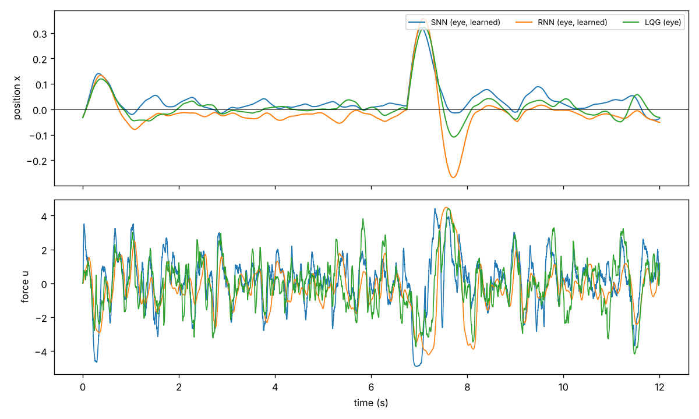
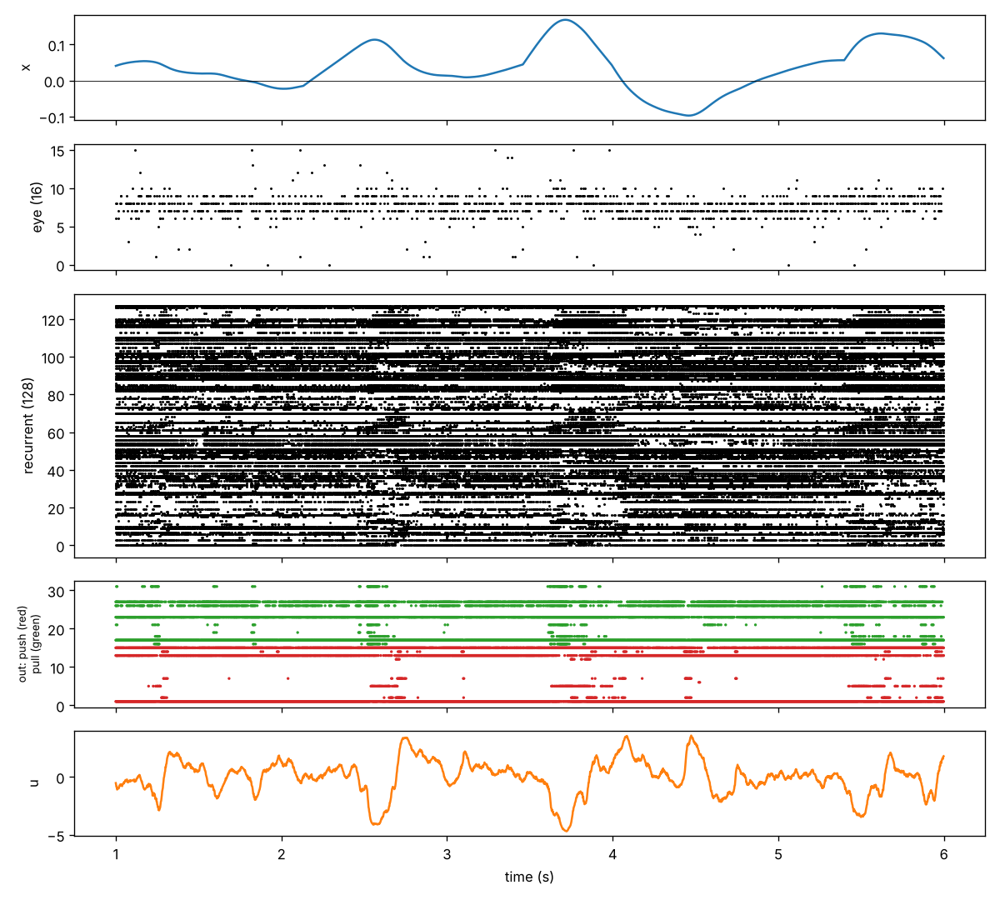
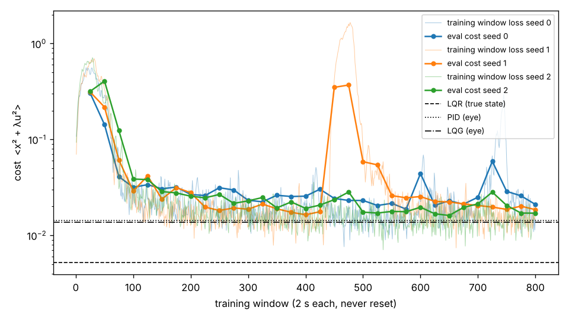

# SNN feedback controller

What control strategy does a recurrent spiking network discover
when its only objective is to keep a physical system at a target, and its only
input is a population of position-tuned "eye" neurons?

## Task

- **Plant:** harmonic oscillator `m x'' = u + F - k x - c x' + kicks`. The defaults are m = 1,
  k = π² (2 s period), no damping, F = 0, actuator limit `u = 5 tanh(cmd / 5)`, and random
  velocity kicks (0.5/s, std 1 m/s).
  Without control it oscillates forever, so the controller's job is to add damping.
- **Eye:** 16 Poisson neurons with Gaussian tuning curves tiling x ∈ [−1.2, 1.2], each
  firing at up to 100 Hz. This is the only input to the learned controllers.
- **Loss:** `<x² + λu²>` with λ = 1e-3.
- **Time step:** dt = 2 ms.

## Layout

```
snnfc/plant.py      batched differentiable oscillator, kicks, blow-up resets
snnfc/eye.py        Gaussian population eye (straight-through spikes) + population-vector decoder
snnfc/baselines.py  LQR, PID (true state); PID and LQG on the decoded eye; Nelder-Mead tuner
snnfc/models.py     leaky rate RNN and recurrent LIF SNN, both with push/pull output populations + filtered readout
snnfc/train.py      continuous truncated BPTT: state never reset, gradient cut every window
snnfc/sim.py        closed-loop evaluation with common random numbers
run_step0.py        step 0: privileged baselines
run_step1.py        step 1: eye check + fair (eye-only) baselines
run_step2.py        step 2: train the rate RNN and compare  (--eval-only reuses the checkpoint)
run_step3.py        step 3: train the LIF SNN (--seed N), then --report 0 1 2
```

To reproduce, run `pip install -r requirements.txt`, then `python run_step0.py && python run_step1.py && python run_step2.py`.
That takes about 35 minutes on 4 CPU cores. For step 3, train each seed with
`python run_step3.py --seed N` (about 21 minutes per seed, one core each, so seeds can run in parallel),
then run `python run_step3.py --report 0 1 2`. Outputs go to `results/`.

## Results so far

All controllers are evaluated on 64 plants for 60 s with the same held-out disturbance
sequence. Baselines were tuned on a separate seed.

| controller | sees | cost | × LQR | ⟨x²⟩ | ⟨u²⟩ |
|---|---|---:|---:|---:|---:|
| none | – | 0.959 | 184 | 0.959 | 0 |
| LQR | true x, v | 0.00520 | 1.00 | 0.00366 | 1.54 |
| PID (tuned) | true x, v | 0.00511 | 0.98 | 0.00345 | 1.66 |
| PID (tuned) | eye only | 0.01422 | 2.73 | 0.00969 | 4.52 |
| LQG (Kalman + LQR, tuned) | eye only | 0.01362 | 2.62 | 0.01041 | 3.21 |
| rate RNN, learned (step 2) | eye only | 0.01625 | 3.12 | 0.01386 | 2.39 |
| **LIF SNN, learned (step 3), mean of 3 seeds** | eye only | **0.01597** | 3.07 | – | – |
| LIF SNN, per seed (0 / 1 / 2) | eye only | 0.0179 / 0.0159 / 0.0142 | 3.43 / 3.05 / 2.72 | | |
| LIF SNN, seed 2 | eye only | 0.01417 | 2.72 | 0.01112 | 3.05 |

The best SNN seed was chosen using this same evaluation, so quote the mean across seeds
as the headline number; the per-seed spread is about ±12%.





Step 2 figures: [traces](results/step2_traces.png), [learning curve](results/step2_learning_curve.png).

### What this establishes

1. **Step 0: the scale of the task.** LQR with full state is the floor. PID with the true
   velocity matches it, slightly beating it because LQR ignores actuator saturation.
2. **Step 1: the eye is the bottleneck.**
   - A population-vector decoder with a 10–40 ms filter recovers x with an RMS error of
     0.07–0.11 (R² about 0.95), at the cost of 8–38 ms of lag.
   - Even the best classical controllers that see only the eye cost about 2.6× the LQR
     floor. So 2.6× is the realistic target for a learned controller, not 1×.
3. **Step 2: the training setup works.**
   - A 128-unit rate RNN with push/pull output populations, trained by truncated BPTT on
     the closed loop (2 s windows, never reset), reached a cost within 20% of the tuned
     eye-only LQG in about 9 minutes of CPU training.
   - No plant ever had to be reset.
   - It was told nothing about position error, velocity or integrals.
4. **Step 3: a recurrent spiking network learns it just as well.** The network has:
   - 128 recurrent LIF neurons with random sparse connections (20%);
   - push and pull output populations of 16 LIF neurons each;
   - current-based synapses (τ_syn 5 ms, τ_mem 20 ms) with soft reset;
   - fast-sigmoid surrogate gradients.

   Trained with exactly the same loop as the RNN (800 windows, about 21 minutes per seed),
   it averages 0.0160 across 3 seeds, the same as the RNN. The best seed matches the
   eye-only PID and is within 4% of the eye-only LQG.

### Early observations, to be examined properly in step 4

- **Smoother control (RNN).** The RNN's force is much smoother than the eye-based PID and LQG
  (⟨u²⟩ 2.4 vs 3.2–4.5). It filters sensor noise more heavily and accepts more position
  error in exchange.
- **Small steady offsets.** The RNN sits slightly below the target (about −0.03) and the
  SNN slightly above (about +0.03). There is no bias force, so nothing forces either
  network to remove its own bias.
- **Overshoot after large kicks:** the RNN overshoots much more than LQG. The SNN does not,
  and its kick response looks very like LQG's.
- **Output populations split into two roles.** In the SNN raster, a few output neurons on
  each side fire continuously and set a baseline. The rest are recruited in bursts only
  during large deviations.
- **Firing rates climbed during training.** Nothing in the loss penalises spikes, so the
  recurrent population went from about 22 Hz at initialisation to about 120 Hz, and many
  neurons fire continuously. 41% of output neurons ended up silent, while the active ones
  fire at about 150 Hz. An activity penalty would make this more biologically plausible.
  It's worth testing whether that changes the strategy.
- **Not a static PD law.** A linear fit `u ≈ −(6.0 x + 1.2 v)` to the true state explains
  only R² = 0.33 of the force. Delays and noise filtering matter, which is exactly what the
  step 4 analyses are designed to tease apart: lagged regression, a stiffness (k) sweep,
  and velocity probes.

### Notes and fixes made along the way

- **Decoder.** The first decoder, a linear readout fitted on overly wide data, reached only
  R² ≈ 0.55. It was replaced by a normalised population vector, which reaches R² ≈ 0.95.
- **Tuner.** scipy's Nelder-Mead default initial simplex froze any parameter starting at 1
  (log 0). The tuner now builds its own initial simplex.
- **Exploding gradients in the SNN.** With a surrogate-gradient scale of 0.5, gradient norms
  went above 2000 by window 60–70: clipping kept training running, but the controllers
  stalled at about 0.18 and one seed diverged. A 150-window sweep on seed 0 isolated the
  cause (logs in `results/step3_diagnostics/`):

  | variant | max gradient norm | eval cost at window 150 |
  |---|---:|---:|
  | scale 0.3 | 0.8 | 0.031 |
  | scale 0.3, no gradient through the eye | 0.9 | 0.026 |
  | scale 0.5, no gradient through the eye | 2×10⁶ | 0.054 |
  | scale 0.5, 500-step windows | 46 | 0.079 |

  The fix was the surrogate scale, now 0.3, the value Bellec et al. use for long BPTT. The
  closed-loop path through the eye was not the cause. (The scale-0.5 three-seed runs were
  stopped before their logs were saved; the numbers above come from their console output.)
- **One transient collapse.** SNN seed 1 lost control for about 50 windows mid-training
  (windows 450–500, with 3 plant resets) and then recovered. Its gradients stayed small,
  so a parameter step pushed the closed loop over a stability boundary rather than
  anything exploding. Keeping the best checkpoint, or decaying the learning rate, would
  guard against this.
- **Gradient through the eye.** The eye uses a straight-through estimator: real Bernoulli
  spikes going forward, d(rate)/dx going backward. This lets gradients go around the whole
  loop, plant → eye → network → plant.

## Next

- **Step 4:**
  - Regress u on lagged x, v and ∫x.
  - Sweep k from 0.5× to 2× to separate true derivative action from delayed proportional
    feedback.
  - Fit linear probes for ẋ and ∫x on the recurrent activity.
  - Add a constant force F to make integral action necessary.
- **Optional:** add a spike-rate penalty to the SNN, keep the best checkpoint, and decay the
  learning rate.
