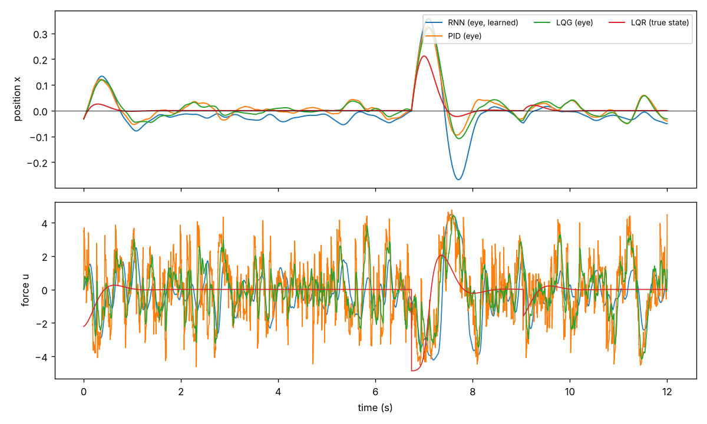
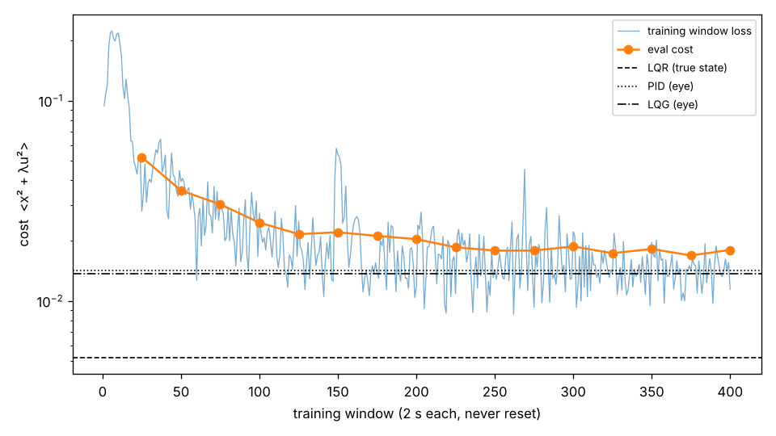

# SNN feedback controller

What control strategy does a recurrent (eventually spiking) network discover
when its only objective is to keep a physical system at a target, and its only
input is a population of position-tuned "eye" neurons?

## Task

- **Plant:** harmonic oscillator `m x'' = u + F - k x - c x' + kicks`. The defaults are m = 1,
  k = π² (2 s period), no damping, F = 0, actuator limit `u = 5 tanh(cmd / 5)`, and random
  velocity kicks (0.5/s, std 1 m/s).
  Without control it oscillates forever, so the controller's job is to add damping.
- **Eye:** 16 Poisson neurons with Gaussian tuning curves tiling x ∈ [−1.2, 1.2], each
  firing at up to 100 Hz. This is the only input to the learned controllers.
- **Loss:** `<x² + λu²>` with λ = 1e-3.
- **Time step:** dt = 2 ms.

## Layout

```
snnfc/plant.py      batched differentiable oscillator, kicks, blow-up resets
snnfc/eye.py        Gaussian population eye (straight-through spikes) + population-vector decoder
snnfc/baselines.py  LQR, PID (true state); PID and LQG on the decoded eye; Nelder-Mead tuner
snnfc/models.py     leaky rate RNN with push/pull output populations + filtered readout
snnfc/train.py      continuous truncated BPTT: state never reset, gradient cut every window
snnfc/sim.py        closed-loop evaluation with common random numbers
run_step0.py        step 0: privileged baselines
run_step1.py        step 1: eye check + fair (eye-only) baselines
run_step2.py        step 2: train the rate RNN and compare  (--eval-only reuses the checkpoint)
```

To reproduce, run `pip install -r requirements.txt`, then `python run_step0.py && python run_step1.py && python run_step2.py`.
That takes about 35 minutes on 4 CPU cores. Outputs go to `results/`.

## Results so far

All controllers are evaluated on 64 plants for 60 s with the same held-out disturbance
sequence. Baselines were tuned on a separate seed.

| controller | sees | cost | × LQR | ⟨x²⟩ | ⟨u²⟩ |
|---|---|---:|---:|---:|---:|
| none | – | 0.959 | 184 | 0.959 | 0 |
| LQR | true x, v | 0.00520 | 1.00 | 0.00366 | 1.54 |
| PID (tuned) | true x, v | 0.00511 | 0.98 | 0.00345 | 1.66 |
| PID (tuned) | eye only | 0.01422 | 2.73 | 0.00969 | 4.52 |
| LQG (Kalman + LQR, tuned) | eye only | 0.01362 | 2.62 | 0.01041 | 3.21 |
| **rate RNN, learned** | eye only | **0.01625** | 3.12 | 0.01386 | 2.39 |




### What this establishes

1. **Step 0: the scale of the task.** LQR with full state is the floor. PID with the true
   velocity matches it, slightly beating it because LQR ignores actuator saturation.
2. **Step 1: the eye is the bottleneck.**
   - A population-vector decoder with a 10–40 ms filter recovers x with an RMS error of
     0.07–0.11 (R² about 0.95), at the cost of 8–38 ms of lag.
   - Even the best classical controllers that see only the eye cost about 2.6× the LQR
     floor. So 2.6× is the realistic target for a learned controller, not 1×.
3. **Step 2: the training setup works.**
   - A 128-unit rate RNN with push/pull output populations, trained by truncated BPTT on
     the closed loop (2 s windows, never reset), reached a cost within 20% of the tuned
     eye-only LQG in about 9 minutes of CPU training.
   - No plant ever had to be reset.
   - It was told nothing about position error, velocity or integrals.

### Early observations, to be examined properly in step 4

- **Smoother control.** The RNN's force is much smoother than the eye-based PID and LQG
  (⟨u²⟩ 2.4 vs 3.2–4.5). It filters sensor noise more heavily and accepts more position
  error in exchange.
- **Small steady offset.** It sits slightly below the target (about −0.03). There is no
  bias force to learn from, so nothing forces it to remove its own bias.
- **More overshoot after large kicks** than LQG.
- **Not a static PD law.** A linear fit `u ≈ −(6.0 x + 1.2 v)` to the true state explains
  only R² = 0.33 of the force. Delays and noise filtering matter, which is exactly what the
  step 4 analyses are designed to tease apart: lagged regression, a stiffness (k) sweep,
  and velocity probes.

### Notes and fixes made along the way

- **Decoder.** The first decoder, a linear readout fitted on overly wide data, reached only
  R² ≈ 0.55. It was replaced by a normalised population vector, which reaches R² ≈ 0.95.
- **Tuner.** scipy's Nelder-Mead default initial simplex froze any parameter starting at 1
  (log 0). The tuner now builds its own initial simplex.
- **Gradient through the eye.** The eye uses a straight-through estimator: real Bernoulli
  spikes going forward, d(rate)/dx going backward. This lets gradients go around the whole
  loop, plant → eye → network → plant.

## Next

- **Step 3:** swap the rate RNN for LIF neurons with surrogate gradients, keeping the same
  loop, readout and baselines.
- **Step 4:**
  - Regress u on lagged x, v and ∫x.
  - Sweep k from 0.5× to 2× to separate true derivative action from delayed proportional
    feedback.
  - Fit linear probes for ẋ and ∫x on the recurrent activity.
  - Add a constant force F to make integral action necessary.
